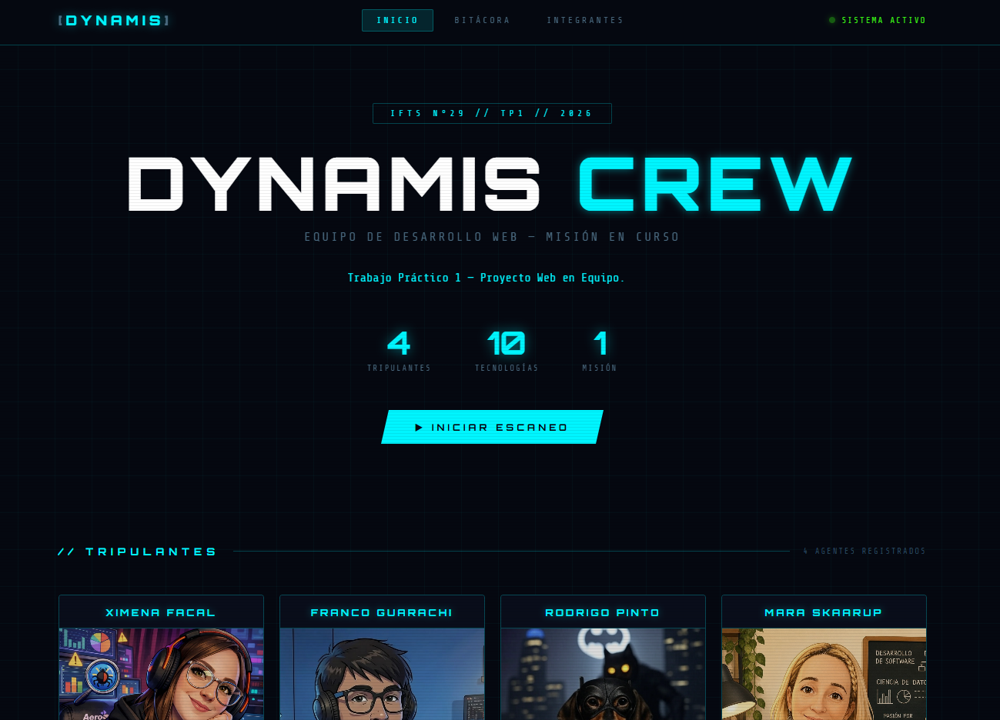
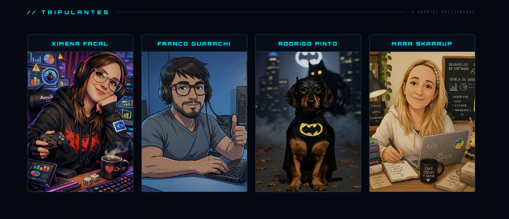
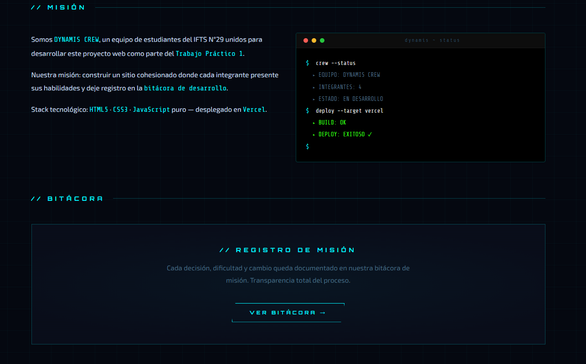
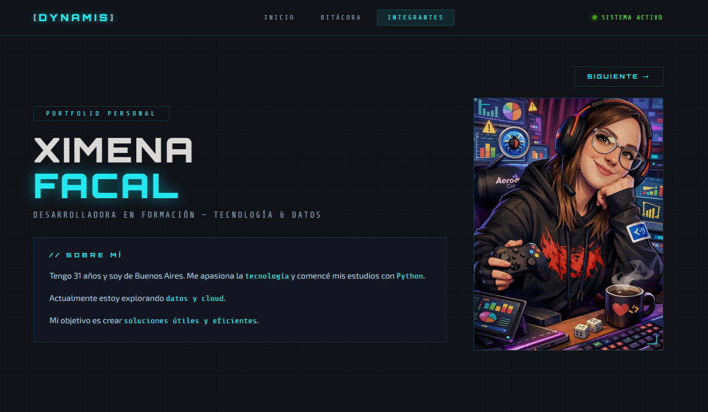
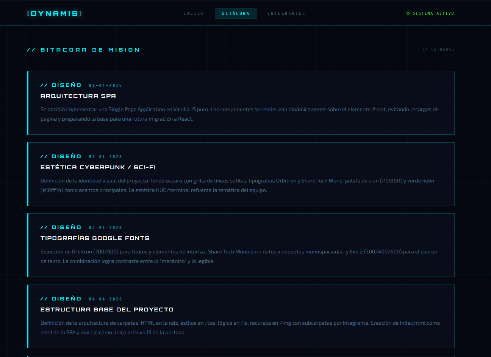

# Trabajo Práctico Grupal 1 - Proyecto Web en Equipo

**[Link a Vercel](https://tpo1-front.vercel.app/)** 

---

## Descripción del Proyecto

Este trabajo práctico consiste en el desarrollo de un sitio web colaborativo que funciona como presentación del equipo **DYNAMIS CREW**. El objetivo es aplicar buenas prácticas de maquetación, diseño adaptable y manipulación del DOM mediante JavaScript Vanilla.

El sitio incluye una portada con navegación dinámica tipo SPA (Single Page Application), tarjetas individuales de cada integrante con información personal, habilidades y hobbies, y una bitácora de desarrollo. Cada perfil individual cuenta con navegación entre integrantes y un cursor personalizado animado.

---

## Integrantes

1. Ximena Facal — **[GitHub](https://github.com/ximefacal)**
2. Franco Guarachi — **[GitHub](https://github.com/FrancoG31)**
3. Rodrigo Pinto — **[GitHub](https://github.com/rodgpinto)**
4. Mara Skaarup — **[GitHub](https://github.com/SkamarluzJH)**

---
## Muestra del index
<p align="center">
  
    
  

  
</p>

---
## Muestra de la sección integrantes
<p align="center">
  
 
</p>

---
## Muestra de la sección bitácora
<p align="center">
  
</p>

---

## Tecnologías Utilizadas

1. **HTML5** para la estructura semántica de todas las páginas.
2. **CSS3** (Flexbox / Grid) para el diseño adaptable y la estética sci-fi/cyberpunk.
3. **JavaScript Vanilla** para la arquitectura SPA, interactividad y navegación dinámica.
4. **Google Fonts** — [Orbitron](https://fonts.google.com/specimen/Orbitron), [Share Tech Mono](https://fonts.google.com/specimen/Share+Tech+Mono) y [Exo 2](https://fonts.google.com/specimen/Exo+2) para la tipografía temática.
5. **Vercel** para el despliegue continuo.

---

## Estructura de Archivos

Los archivos HTML de cada perfil se ubican en la raíz para simplificar la navegación entre páginas. Los estilos se centralizan en `/css`, la lógica de la SPA en `/js` y todos los recursos visuales en `/img`. La carpeta `/img` contiene subcarpetas por integrante para organizar fotos e imágenes de hobbies.

```
/
├── index.html
├── ximena.html
├── franco.html
├── rodrigo.html
├── mara.html
├── css/
│   └── styles.css
├── js/
│   └── main.js
└── img/
    ├── ximena/
    ├── franco/
    ├── rodrigo/
    └── mara/
```

---

## Guía de Estilos

1. **Paleta de Colores:** Fondo principal `#050810`, texto principal `#c8ddf0`, acento cyan `#00f5ff`, verde sistema `#39ff14`, rojo alerta `#ff2d55`. El fondo incluye una grilla de líneas sutiles que refuerza la estética de terminal/HUD.
2. **Tipografías:** [Orbitron](https://fonts.google.com/specimen/Orbitron) para títulos y elementos de interfaz, [Share Tech Mono](https://fonts.google.com/specimen/Share+Tech+Mono) para datos y etiquetas monospaciadas, [Exo 2](https://fonts.google.com/specimen/Exo+2) para el cuerpo de texto.
3. **Efectos visuales:** Scanlines globales via `body::before`, cursor personalizado con dot + ring animado, efecto de texto typewriter en la portada, y animaciones de entrada `smashIn` / `fadeUp` en todos los componentes.
4. **Iconografía:** No se utilizó librería de íconos externa. Los íconos de contacto (GitHub, LinkedIn, email) se implementaron como SVG inline. Las ilustraciones de perfil fueron generadas con IA para mantener un estilo visual consistente con la temática del proyecto.

---

## JavaScript

### Portada (`index.html` + `js/main.js`)

Arquitectura **SPA** completa en Vanilla JS. El archivo `main.js` gestiona todo el renderizado dinámico:

- **`navigate(page)`** — router principal que renderiza `Home()` o `Bitacora()` en el `#root` sin recargar la página.
- **`Home()`** — componente que genera el HTML de la portada, incluyendo las tarjetas de tripulantes, sección misión y preview de bitácora.
- **`Bitacora()`** — componente que renderiza las entradas del log de desarrollo.
- **`startTypewriter(id, phrases)`** — efecto de escritura/borrado cíclico sobre el subtítulo de la portada.
- **`animateCounters()`** — anima los contadores de estadísticas del equipo usando `IntersectionObserver` para dispararse al hacer scroll.
- **`triggerSFX(e, word)`** — genera un elemento flotante con texto animado en la posición del cursor al interactuar con tarjetas.
- **`triggerScan()`** — activa el overlay de escaneo con línea animada antes de navegar a un perfil.
- **`handleCardClick(e, id)`** — maneja el clic en tarjetas de tripulantes: dispara SFX + scan y redirige al perfil individual con un delay de 900ms.
- **`scrollToIntegrantes()`** — hace scroll suave a la sección de tripulantes si está en home; redirige a `ximena.html` si se llama desde otra vista.
- **Detección de `?page=bitacora`** — al cargar `index.html` con ese parámetro, navega directamente a la bitácora (usado por el botón BITÁCORA de los perfiles individuales).

### Perfiles Individuales (`ximena.html`, `franco.html`, `rodrigo.html`, `mara.html`)

Cada perfil es una página HTML estática con cursor personalizado y navegación entre integrantes:

- **Cursor animado** — dot + ring que reacciona al pasar sobre elementos interactivos, implementado con `mousemove` y `mouseover`.
- **Botones de navegación entre perfiles** — permiten recorrer los perfiles en orden (Ximena → Franco → Rodrigo → Mara) sin volver al inicio.
- **Botón BITÁCORA** — redirige a `index.html?page=bitacora` para cargar directamente esa sección.

---

## Uso de IA

1. **Imágenes:** Las ilustraciones de perfil de los integrantes fueron generadas con herramientas de IA con un estilo de ilustración digital/cómic acorde a la temática cyberpunk del proyecto.
